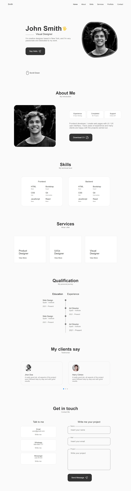

# React Portfolio Website Practice

This React website is a cloned project I developed to deepen my understanding of React's component-based architecture and modern web development practices. While based on an existing design, I added personalized tweaks and optimizations to enhance functionality and performance, showcasing my ability to work with React effectively and creatively.
 
I created this website on <b> November 2024 </b>, as a role in <b>Coding</b>.

